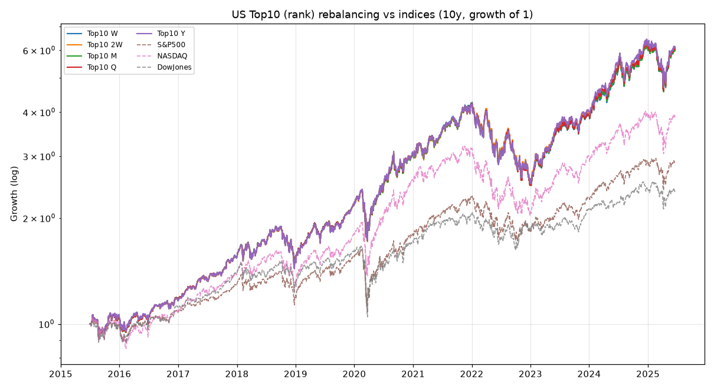
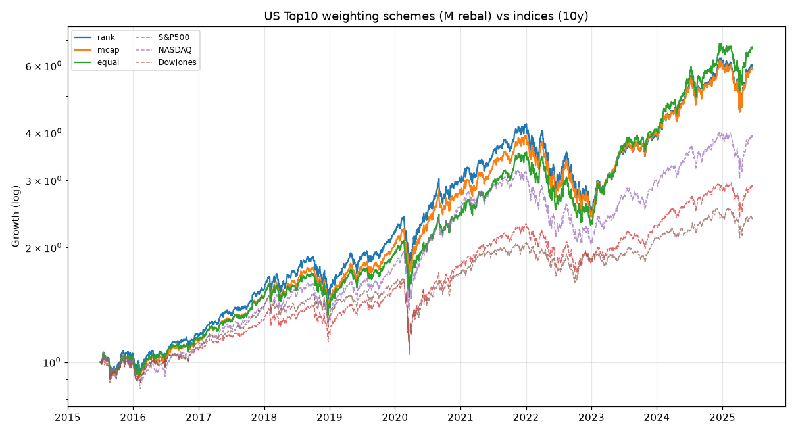
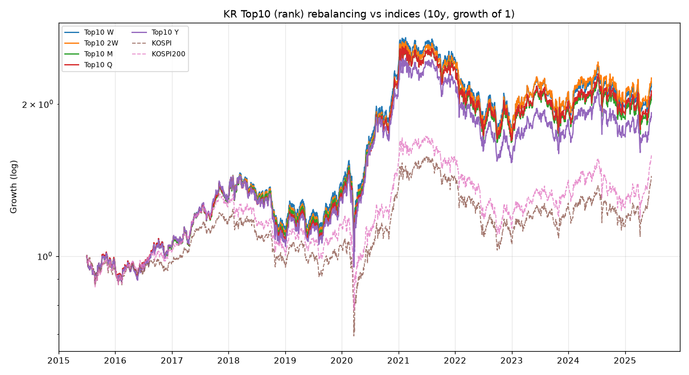
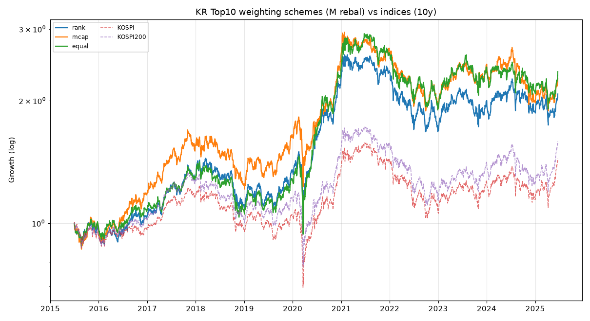

# 한국·미국 시총 Top10 가중 리밸런싱 백테스트 종합 리포트

작성일: 2026-06-29 / 데이터 기준일: 2025-06-20

---

## 1. 무엇을 했나 (요약 한 문단)

> "시가총액 상위 10종목을, 상위에 더 높은 가중치로 담고, **매주·격주·매월·분기·매년** 리밸런싱하면서
> 5년·10년 보유했을 때 수익률이 어땠고, 종합주가지수보다 나았나?" — 그리고 리밸런싱 시점마다 Top10이
> 바뀌는 것까지 반영해서.

결론부터: **미국은 모든 주기·모든 가중방식에서 지수를 크게 압도(10년 CAGR ~19–21% vs S&P500 11.2%)**
했고, **한국은 10년 기준 지수를 확실히 이겼지만(CAGR ~7–10% vs KOSPI 3.7%), 최근 5년만 보면 메가캡 집중
전략(순위선형·시총가중)은 KOSPI200에 오히려 살짝 못 미쳤습니다**(균등가중만 소폭 우위).

리밸런싱 **주기는 수익률에 거의 영향이 없었고**(차이 1–2%p 수준), 오히려 **자주 갈아탈수록 거래비용이
누적(미국 매주 ~4%, 한국 매주 ~5% 드래그)**되어 약간 불리했습니다. 가장 큰 변수는 주기가 아니라
**가중 방식**과 **시장**이었습니다.

---

## 2. 방법론

| 항목 | 설정 |
|---|---|
| 대상 | 미국 대형주 / 한국(KOSPI) 대형주 |
| 종목 선정 | 각 리밸런싱 시점이 속한 **연도의 시총 Top10** (연 단위로 멤버십 교체) |
| 가중 방식 | ① 순위선형(1위=10…10위=1) ② 시총가중 ③ 균등(1/10) — **세 가지 모두 비교** |
| 리밸런싱 주기 | 매주(W) · 격주(2W) · 매월(M) · 분기(Q) · 매년(Y) |
| 거래비용 | 리밸런싱 시 turnover × 편도수수료 (미국 0.10%, 한국 0.15%≈거래세 포함) 차감 — **반영** |
| 기간 | 10년: 2015-07 ~ 2025-06 / 5년: 2020-06 ~ 2025-06 |
| 데이터 | FinanceDataReader(일별 종가). 미국=stooq 수정주가, 한국=KRX, 지수=Yahoo |
| 벤치마크 | 미국: S&P500 · NASDAQ종합 · 다우존스 / 한국: KOSPI · KOSPI200 |

**가중치 정의**
- 순위선형: 1위가 10, 2위 9, …, 10위 1 → 합으로 정규화 (상위에 더 높은 가중)
- 시총가중: 종목 시총 ÷ Top10 시총합 (실제 지수와 가장 유사, 1~2위 비중이 매우 큼)
- 균등: 각 1/10 (상대적으로 하위 종목에 더 많이 배분)

---

## 3. 미국 — 결과

### 3-1. 10년 (2015-07 ~ 2025-06)

**연평균수익률(CAGR)**

| 리밸런싱 | 순위선형 | 시총가중 | 균등 |
|---|---|---|---|
| 매주 (W)  | 19.7% | 19.5% | **21.1%** |
| 격주 (2W) | 19.8% | 19.5% | 20.9% |
| 매월 (M)  | 19.7% | 19.5% | 20.9% |
| 분기 (Q)  | 19.8% | 19.6% | 21.1% |
| 연 (Y)    | 19.9% | 19.8% | **21.5%** |

**누적수익률 (1.0 투자 → 배수)**: 순위선형 약 **+500%(6.0배)**, 균등 약 **+575~597%(6.7~7.0배)**

**지수 (10년)**

| 지수 | 누적 | CAGR | MDD |
|---|---|---|---|
| S&P500 | +187.9% | 11.2% | -33.9% |
| NASDAQ종합 | +289.9% | 14.6% | -36.4% |
| 다우존스 | +137.5% | 9.1% | -37.1% |

→ **Top10 전략(어느 주기든) 누적 +490~600%로 S&P500(+188%)·NASDAQ(+290%)·다우(+138%)를 모두 압도.**
이유는 단순합니다. 지난 10년 미국 대형주의 초과수익이 사실상 Top10(애플·MS·아마존·구글·엔비디아·메타·테슬라)에
집중됐고, 이 전략은 그 종목들만 골라 담았기 때문입니다.

### 3-2. 5년 (2020-06 ~ 2025-06)

| 리밸런싱 | 순위선형 | 시총가중 | 균등 |
|---|---|---|---|
| 매주 | 19.6% | 20.9% | **26.9%** |
| 매월 | 19.6% | 20.9% | 26.8% |
| 연   | 20.0% | 21.4% | **27.9%** |

지수 5년 CAGR: S&P500 13.9% / NASDAQ 14.3% / 다우 10.2% → **여전히 전 주기·전 방식이 지수 압도.**
이 구간에선 **균등가중이 가장 강했는데(27%대)**, 엔비디아·테슬라·메타처럼 "Top10 안에서도 상대적으로
순위가 낮았던" 종목들이 폭등하면서, 상위 1~2위에 비중을 몰아준 시총가중보다 골고루 담은 균등이 유리했습니다.

### 3-3. 연말 자산가치 추이 (순위선형, 시작=1.00) — 시간순

| 연말 | 매주 | 격주 | 매월 | 분기 | 연 | S&P500 | NASDAQ | 다우 |
|---|---|---|---|---|---|---|---|---|
| 2015 | 1.03 | 1.04 | 1.03 | 1.04 | 1.04 | 0.98 | 1.00 | 0.98 |
| 2016 | 1.17 | 1.16 | 1.17 | 1.17 | 1.16 | 1.08 | 1.07 | 1.11 |
| 2017 | 1.54 | 1.54 | 1.54 | 1.54 | 1.54 | 1.29 | 1.38 | 1.39 |
| 2018 | 1.55 | 1.55 | 1.55 | 1.55 | 1.54 | 1.21 | 1.32 | 1.31 |
| 2019 | 2.18 | 2.18 | 2.18 | 2.18 | 2.18 | 1.56 | 1.79 | 1.61 |
| 2020 | 3.05 | 3.04 | 3.04 | 3.06 | 3.06 | 1.81 | 2.57 | 1.72 |
| 2021 | 4.18 | 4.14 | 4.14 | 4.14 | 4.13 | 2.29 | 3.12 | 2.05 |
| 2022 | 2.58 | 2.59 | 2.55 | 2.56 | 2.59 | 1.85 | 2.09 | 1.87 |
| 2023 | 3.91 | 3.99 | 3.92 | 3.93 | 4.04 | 2.30 | 2.99 | 2.12 |
| 2024 | 6.02 | 6.07 | 6.01 | 6.09 | 6.17 | 2.83 | 3.85 | 2.40 |
| 2025 | 6.01 | 6.06 | 5.98 | 6.06 | 6.11 | 2.88 | 3.90 | 2.37 |




---

## 4. 한국 — 결과

### 4-1. 10년 (2015-07 ~ 2025-06)

**연평균수익률(CAGR)**

| 리밸런싱 | 순위선형 | 시총가중 | 균등 |
|---|---|---|---|
| 매주 (W)  | 8.3% | 8.9% | **9.6%** |
| 격주 (2W) | 8.5% | 8.8% | 9.4% |
| 매월 (M)  | 7.6% | 8.5% | 9.0% |
| 분기 (Q)  | 7.8% | 8.6% | 9.0% |
| 연 (Y)    | 6.8% | 8.1% | 8.5% |

**누적수익률**: 순위선형 +92~120%, 시총가중 +118~134%, 균등 +125~150%

**지수 (10년)**

| 지수 | 누적 | CAGR | MDD |
|---|---|---|---|
| KOSPI | +44.0% | 3.7% | -43.9% |
| KOSPI200 | +58.9% | 4.8% | -41.2% |

→ **10년 기준 Top10 전략(어느 주기·방식이든)이 KOSPI/KOSPI200을 확실히 이김** (누적 +92~150% vs +44~59%).
한국은 미국과 달리 **자주 리밸런싱할수록(매주·격주) 더 좋았습니다** — 대형주 주가가 평균회귀(mean-reverting)
성향이 있어, 오른 종목 비중을 줄이고 빠진 종목을 다시 채우는 리밸런싱 효과가 더 컸습니다.

> ※ **KOSPI100은 무료 데이터 소스에 지수 시계열이 없어**(yahoo/FDR 404) 비교에서 제외하고
> KOSPI200 + KOSPI종합으로 대체했습니다. (한계 참고)

### 4-2. 5년 (2020-06 ~ 2025-06) — 주의 깊게 볼 구간

| 리밸런싱 | 순위선형 | 시총가중 | 균등 |
|---|---|---|---|
| 매주 | 5.8% | 5.9% | **7.9%** |
| 매월 | 5.3% | 5.6% | 7.4% |
| 연   | 4.7% | 5.1% | 7.0% |

지수 5년 CAGR: **KOSPI 7.3% / KOSPI200 7.6%**

→ **최근 5년만 보면 순위선형·시총가중 Top10은 KOSPI200(7.6%)에 오히려 못 미쳤고**, 균등가중만 매주 기준
7.9%로 간신히 앞섰습니다. 삼성전자·SK하이닉스 같은 1~2위 메가캡에 비중이 쏠리는 방식이, 이 구간 삼성전자의
부진(2024~2025) 때문에 발목을 잡혔습니다. 상위 집중도가 높을수록(시총가중>순위선형) 더 불리했던 셈입니다.

### 4-3. 연말 자산가치 추이 (순위선형, 시작=1.00) — 시간순

| 연말 | 매주 | 격주 | 매월 | 분기 | 연 | KOSPI | KOSPI200 |
|---|---|---|---|---|---|---|---|
| 2015 | 0.96 | 0.96 | 0.96 | 0.96 | 0.96 | 0.93 | 0.94 |
| 2016 | 1.04 | 1.04 | 1.04 | 1.05 | 1.05 | 0.97 | 1.02 |
| 2017 | 1.31 | 1.31 | 1.30 | 1.31 | 1.31 | 1.18 | 1.27 |
| 2018 | 1.15 | 1.13 | 1.11 | 1.09 | 1.08 | 0.97 | 1.03 |
| 2019 | 1.39 | 1.36 | 1.35 | 1.33 | 1.30 | 1.05 | 1.15 |
| 2020 | 2.36 | 2.29 | 2.27 | 2.27 | 2.16 | 1.37 | 1.53 |
| 2021 | 2.45 | 2.41 | 2.35 | 2.35 | 2.21 | 1.42 | 1.55 |
| 2022 | 1.76 | 1.73 | 1.68 | 1.69 | 1.53 | 1.07 | 1.14 |
| 2023 | 2.10 | 2.11 | 1.99 | 2.02 | 1.86 | 1.27 | 1.40 |
| 2024 | 1.98 | 2.02 | 1.88 | 1.93 | 1.74 | 1.14 | 1.25 |
| 2025 | 2.20 | 2.25 | 2.08 | 2.12 | 1.92 | 1.44 | 1.59 |




---

## 5. 리밸런싱 주기·거래비용 효과 (10년, 순위선형)

| 시장 | 주기 | 리밸런싱 횟수 | 누적 거래비용 드래그 | CAGR |
|---|---|---|---|---|
| US | 매주 | 521 | 4.0% | 19.7% |
| US | 격주 | 261 | 3.1% | 19.8% |
| US | 매월 | 120 | 2.3% | 19.7% |
| US | 분기 | 40 | 1.5% | 19.8% |
| US | 연 | 11 | 0.7% | 19.9% |
| KR | 매주 | 520 | 4.9% | 8.3% |
| KR | 격주 | 261 | 3.8% | 8.5% |
| KR | 매월 | 120 | 2.7% | 7.6% |
| KR | 분기 | 40 | 1.9% | 7.8% |
| KR | 연 | 11 | 1.0% | 6.8% |

**핵심 시사점**
1. **주기는 수익률을 거의 못 바꾼다.** 미국은 주기 무관 ~19.5–21.5%, 한국은 ~6.8–9.6%. 멤버십이 연 단위로만
   바뀌므로 주중 리밸런싱은 "비중 재조정" 효과뿐인데, 그 효과가 작다.
2. **자주 갈아탈수록 비용만 쌓인다.** 매주는 10년간 4~5%의 비용 드래그. 미국은 momentum이 강해 *덜* 만질수록
   (연 1회) 미세하게 유리, 한국은 mean-reversion이 강해 *자주* 만질수록 미세하게 유리 — 단 둘 다 차이는 작다.
3. **가장 큰 결정 변수는 "가중 방식"**: 두 시장 모두 **균등가중 ≥ 시총가중 ≥ 순위선형** 경향. 즉
   "상위에 더 몰아주기"가 직관과 달리 최근 10년에는 약간 손해였다 — 초대형 1~2위보다 Top10 내 3~10위
   종목들의 상승이 더 컸기 때문.

---

## 6. 한계 (반드시 같이 읽어주세요)

1. **시점별 Top10은 "연도별 큐레이션 스냅샷" 근사**입니다. 과거 시총 순위를 시점별로 주는 무료 API가
   없어(pykrx는 KRX 로그인 필요, yfinance는 프록시 TLS 충돌), 공개 시장기록 기반으로 각 연초 Top10을
   직접 정리했습니다. 멤버십 교체는 **연 1회** 반영되므로, 연중에 일어난 순위 변동은 다음 해에 반영됩니다.
   → 메가캡 Top10은 연중 거의 안 바뀌므로 합리적 근사지만, 정확한 인덱스 리컨스티튜션은 아닙니다.
2. **시총가중의 cap 값은 근사치**입니다(연초 대략적 시총). 순위선형·균등은 순위만 쓰므로 영향 없음.
3. **KOSPI100 지수 데이터 부재** → KOSPI200 + KOSPI종합으로 대체.
4. **생존편향**: Top10은 모두 "살아남아 큰 회사"라 본질적으로 우상향 편향이 있습니다(다만 연 단위 교체로
   일부 보정). 또 배당 재투자는 미국(수정주가)은 반영, 한국(KRX 종가)은 부분 반영.
5. **거래비용은 단순화**(turnover×편도율). 호가 스프레드·시장충격·세금 디테일·환율은 미반영.
6. **과거 성과가 미래를 보장하지 않습니다.** 특히 미국의 압도적 성과는 "지난 10년 빅테크 집중 랠리"라는
   특정 레짐의 결과입니다.

---

## 7. 재현 방법

```bash
cd stock-rebalancing-analysis
export REQUESTS_CA_BUNDLE=/root/.ccr/ca-bundle.crt   # 프록시 환경에서만
python3 fetch_prices.py     # 일별 종가 → prices.csv 캐시
python3 backtest.py         # 백테스트 → results_*.csv, yearly_*.csv, *.png
```

**산출물**
- `prices.csv` — 일별 종가 캐시(44개 시계열)
- `results_full.csv` — 시장×윈도우×가중×주기별 누적/CAGR/MDD/비용
- `results_index.csv` — 지수별 누적/CAGR/MDD
- `yearly_us.csv`, `yearly_kr.csv` — 연말 자산가치(시간순)
- `equity_*.png`, `scheme_*.png` — 자산곡선/가중방식 비교 차트
- `snapshots.py` — 연도별 Top10 큐레이션 데이터(가정 검토용)
