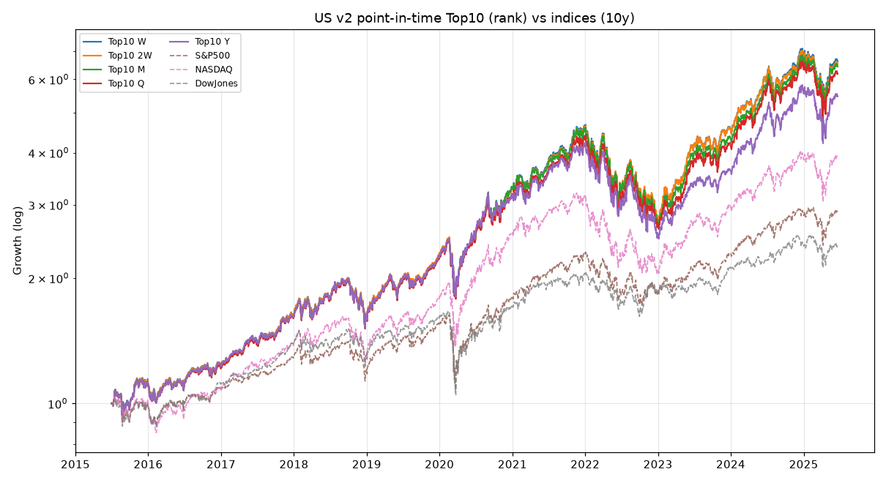
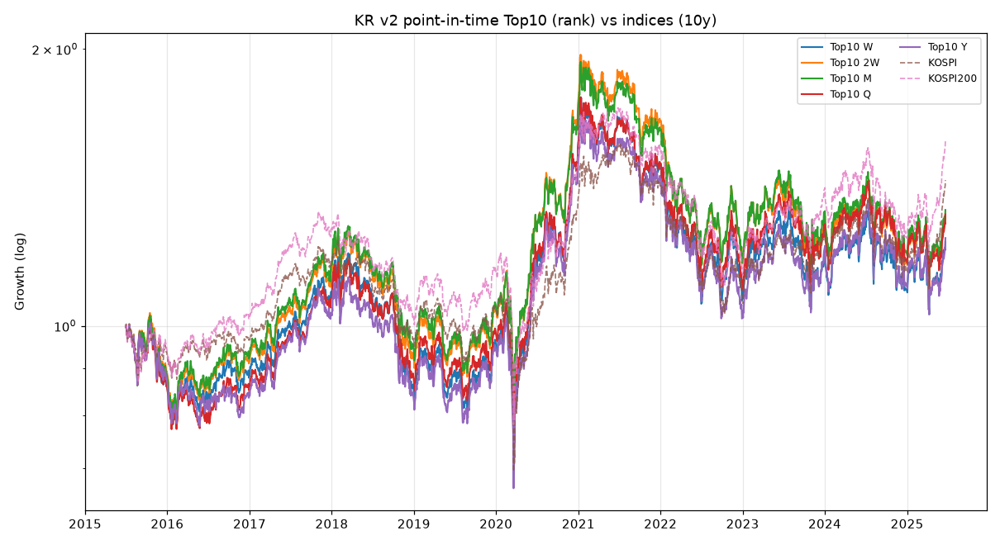

# v2 — "진짜 시점별 Top10" 백테스트 (자동 시가총액 랭킹)

작성일: 2026-06-29 / 데이터 기준일: 2025-06-20
선행 리포트: [`REPORT.md`](REPORT.md) (v1, 연도별 손-큐레이션 스냅샷)

---

## 0. v1과 무엇이 다른가

| | v1 | **v2 (이 문서)** |
|---|---|---|
| Top10 선정 | 연 1회, 사람이 정리한 스냅샷 | **매 리밸런싱일에 그 날 시가총액으로 자동 재계산** |
| 멤버십 교체 | 연 단위 | **주/격주/월/분기/연 — 리밸런싱 주기 그대로** |
| 시총 데이터 | 근사치(보고서용) | 미국=stockanalysis 가격×현재주식수 / 한국=FDR 가격×현재주식수 |
| 사후편향 | 있음(내가 승자를 알고 골랐을 위험) | **없음(그 시점 데이터로만 순위)** |
| 수익률 정의 | 가격수익 | 가격수익(배당 제외) — 가격지수와 공정 비교 |

> v2는 사용자가 요청한 **"리밸런싱 시점마다 Top10이 달라지는 것"을 진짜로 구현**한 버전이다.
> 시가총액을 직접 계산해 매 시점 순위를 다시 매기므로, 누가 언제 Top10에 들어오고 빠졌는지가 결과에 반영된다.

### v2가 드러낸 핵심 결론 (v1과 가장 큰 차이)

- **미국: v1≈v2 (둘 다 CAGR ~20%, 지수 압도).** 방법을 바꿔도 결과가 같다 → 미국 메가캡의 초과수익은
  **사후편향이 아니라 실제 현상**이다.
- **한국: v1 7.6% → v2 3.0% 로 급락, KOSPI200(4.8%) 수준 또는 이하.** v1의 한국 초과수익은 상당 부분
  **내가 성장 승자(네이버·카카오·2차전지·바이오)를 Top10으로 골랐던 사후편향**이었다. v2가 한국전력·삼성생명·
  삼성물산 같은 "크지만 부진했던 진짜 대형주"까지 담자 수익이 지수로 수렴했다.
  → **"한국에서 가장 큰 10종목을 사는 것"은 KOSPI를 안정적으로 이기지 못했다**는, 더 정직한 결론.

---

## 1. 미국 v2

### 10년 CAGR (%)

| 리밸런싱 | 순위선형 | 시총가중 | 균등 |
|---|---|---|---|
| 매주 (W)  | **20.9** | 19.7 | 19.7 |
| 격주 (2W) | 20.7 | 19.5 | 19.1 |
| 매월 (M)  | 20.5 | 19.6 | 19.2 |
| 분기 (Q)  | 20.0 | 19.5 | 19.3 |
| 연 (Y)    | 18.6 | 18.3 | 17.4 |

누적(10년): 순위선형 **+446~562%**, 균등 +393~501%, 시총가중 +433~501%

### 지수 (10년)
- S&P500 +187.9% (CAGR 11.2%) · NASDAQ +289.9% (14.6%) · 다우 +137.5% (9.1%)

→ **모든 주기·방식이 지수를 압도** (CAGR 17~21% vs 9~15%). v1과 거의 동일.
미국은 v2에서 **순위선형(상위 가중)이 가장 좋았다** — 애플·MS·엔비디아 등 진짜 1~5위가 워낙 강해서
상위 집중이 보상받았다. (v1에서는 균등이 약간 앞섰는데, 유니버스/멤버십이 더 정밀해지며 역전.)

### 5년 CAGR (%) — 균등이 최강

| 리밸런싱 | 순위선형 | 시총가중 | 균등 |
|---|---|---|---|
| 매주 | 21.1 | 20.0 | **23.8** |
| 격주 | 21.1 | 20.7 | **25.6** |
| 매월 | 20.5 | 19.4 | 22.1 |
| 연   | 16.0 | 16.4 | 17.1 |

지수 5년: S&P500 13.9% · NASDAQ 14.3% · 다우 10.2% → 여전히 전부 압도.

### 미국 — 매 연초 실제 Top10 (멤버십 변천)

```
2015: Apple, ExxonMobil, Alphabet, Microsoft, Berkshire, J&J, Amazon, GE, Meta, Disney
2016: Alphabet, Microsoft, Apple, Amazon, ExxonMobil, Berkshire, Meta, GE, J&J, Verizon
2017: Alphabet, Microsoft, Apple, Amazon, ExxonMobil, Berkshire, Meta, J&J, GE, JPMorgan
2018: Alphabet, Amazon, Microsoft, Apple, Meta, Berkshire, ExxonMobil, J&J, JPMorgan, Walmart
2019: Amazon, Microsoft, Alphabet, Apple, Berkshire, Meta, J&J, ExxonMobil, JPMorgan, Boeing
2020: Microsoft, Apple, Amazon, Alphabet, Meta, Berkshire, JPMorgan, Visa, J&J, Walmart
2021: Apple, Amazon, Microsoft, Alphabet, Tesla, Meta, Berkshire, Visa, Walmart, J&J
2022: Apple, Microsoft, Amazon, Alphabet, Tesla, Meta, NVIDIA, Berkshire, UnitedHealth, JPMorgan
2023: Apple, Microsoft, Alphabet, Amazon, Berkshire, UnitedHealth, ExxonMobil, J&J, Tesla, Visa
2024: Microsoft, Apple, Alphabet, Amazon, NVIDIA, Tesla, Meta, Berkshire, EliLilly, Broadcom
2025: Apple, NVIDIA, Microsoft, Amazon, Alphabet, Meta, Tesla, Broadcom, Berkshire, Walmart
```
ExxonMobil·GE·Disney·Verizon이 초반 상위 → 점차 탈락, Meta·NVIDIA·Tesla·Broadcom·EliLilly 진입.
**이 멤버십 변화가 자동으로 반영된 것이 v2의 핵심.**



---

## 2. 한국 v2

### 10년 CAGR (%) — 시총가중만 지수 상회

| 리밸런싱 | 순위선형 | 시총가중 | 균등 |
|---|---|---|---|
| 매주 (W)  | 2.1 | **4.5** | 2.5 |
| 격주 (2W) | 2.8 | 4.6 | 3.0 |
| 매월 (M)  | 3.0 | 5.1 | 3.1 |
| 분기 (Q)  | 2.8 | **5.4** | 3.7 |
| 연 (Y)    | 2.2 | 4.9 | 2.7 |

누적(10년): 시총가중 +55~64%, 균등 +28~36%, 순위선형 +23~34%

### 지수 (10년)
- KOSPI +44.0% (CAGR 3.7%) · KOSPI200 +58.9% (CAGR 4.8%)

→ **시총가중(삼성전자·SK하이닉스에 집중)만 KOSPI200을 겨우 상회(5.4% vs 4.8%)**,
순위선형·균등은 지수에 못 미쳤다. 한국전력·삼성생명·삼성물산 등 "크지만 부진한" 대형주를 골고루 담을수록
(순위선형·균등) 오히려 불리. 미국과 정반대로, **한국 대형주는 1~2위 양극화가 심해 집중이 답**이었던 셈.

### 5년 CAGR (%) — 대부분 지수 하회

| 리밸런싱 | 순위선형 | 시총가중 | 균등 |
|---|---|---|---|
| 매주 | 1.3 | 3.1 | 3.9 |
| 매월 | 0.9 | 2.6 | 1.9 |
| 분기 | 2.2 | 3.6 | 4.2 |

지수 5년: KOSPI 7.3% · KOSPI200 7.6% → **최근 5년은 어느 방식도 지수에 미달.**
삼성전자 부진(2024~25)이 시총 1위 비중을 통해 직격.

### 한국 — 매 연초 실제 Top10 (멤버십 변천)

```
2015: 삼성전자, HMM*, SK하이닉스, 한국전력, 삼성물산, 현대차, 삼성생명, SK, 삼성SDS, SK이노베이션
2016: 삼성전자, 한국전력, 현대차, HMM*, LG화학, 삼성물산, 현대모비스, SK하이닉스, 삼성생명, SK이노베이션
2017: 삼성전자, SK하이닉스, 현대차, 한국전력, 현대모비스, SK이노베이션, NAVER, 삼성생명, 신한지주, POSCO
2018: 삼성전자, SK하이닉스, 셀트리온, SK이노베이션, 현대차, LG화학, NAVER, POSCO, 삼성바이오, 삼성생명
2019: 삼성전자, SK하이닉스, 셀트리온, SK이노베이션, 삼성바이오, LG화학, 현대차, 한국전력, POSCO, 신한지주
2020: 삼성전자, SK하이닉스, 셀트리온, 삼성바이오, NAVER, SK이노베이션, 현대차, 현대모비스, LG화학, 신한지주
2021: 삼성전자, SK하이닉스, 셀트리온, LG화학, 삼성바이오, 삼성SDI, NAVER, 현대차, SK이노베이션, 카카오
2022: 삼성전자, SK하이닉스, 삼성바이오, NAVER, 삼성SDI, 카카오, LG화학, 현대차, SK이노베이션, 셀트리온
2023: 삼성전자, LG에너지솔루션, 삼성바이오, SK하이닉스, 삼성SDI, LG화학, 현대차, 셀트리온, NAVER, SK이노베이션
2024: 삼성전자, SK하이닉스, LG에너지솔루션, 삼성바이오, 셀트리온, 현대차, POSCO, 기아, 삼성SDI, NAVER
2025: 삼성전자, SK하이닉스, LG에너지솔루션, 삼성바이오, 현대차, 기아, 셀트리온, NAVER, HD현대중공업, KB금융
```
2018년 이후 멤버십은 실제와 매우 잘 맞는다. **`*` HMM(2015~16)은 오류** — 한국은 KRX 차단으로 *현재* 주식수만
쓰는데, HMM은 이후 대규모 증자(CB 전환)로 주식수가 폭증해 *과거 시총이 과대계상*됐다(아래 한계 참조).



---

## 3. v1 ↔ v2 비교 (10년, 순위선형, 매월 기준)

| 시장 | v1 (큐레이션·연1회) | v2 (자동·시점별) | 해석 |
|---|---|---|---|
| 미국 | 19.7% | 20.5% | 거의 동일 → 미국 우위는 실제 |
| 한국 | 7.6% | **3.0%** | 큰 하락 → v1 한국 우위는 사후편향 |

**시사점**: 백테스트에서 종목 선정 규칙을 "사람이 안다고 가정"하면(v1) 한국처럼 승자가 분산된 시장에서
성과가 과대평가된다. v2처럼 매 시점 데이터로만 자동 선정하면 그 편향이 사라진다. 미국은 우위가 워낙 구조적이라
방법에 둔감했다.

---

## 4. 한계 (v2 기준)

1. **한국 = 현재 주식수 근사 (가장 큰 한계).** KRX가 과거 시가총액 API를 막아(로그인 요구), requests·Playwright
   모두 차단됨. 그래서 *현재* 상장주식수 × 과거(분할조정) 주가로 시총을 계산한다. **자사주/증자/감자로 주식수가
   크게 변한 종목(HMM·두산에너빌리티 등)은 과거 시총이 왜곡**된다(HMM이 2015~16 상위로 잘못 뜨는 이유).
   → 한국 멤버십은 **2018년 이후가 신뢰도 높고**, 2015~17 초반부엔 일부 오류가 있다.
   → 한국에 한해서는, 손-큐레이션이지만 종목이 정확한 **v1을 보조 참고**로 함께 보는 것을 권장.
2. **미국은 정밀.** stockanalysis 분할조정 주가 × 현재주식수(멀티클래스 통합, 예: 알파벳 12.2B주)로 계산.
   잔여 오차는 *자사주 매입분*뿐(애플 등은 과거 시총이 소폭 과소). 멤버십·순위는 실제와 일치.
3. **배당 미반영(가격수익).** 포트폴리오·지수 모두 가격수익으로 통일해 공정 비교했으나, 실제 총수익(배당 재투자)은
   이보다 연 1~3%p 높다. 양쪽 동일 적용이라 *상대* 비교는 유효.
4. **거래비용** 단순화(turnover×편도 US 0.10%/KR 0.15%), 호가 스프레드·시장충격·환율 미반영.
5. **유니버스 범위**: 미국 60·한국 55 후보. 진짜 Top10을 항상 포함하도록 "쇠락한 거인"까지 넣었으나,
   유니버스 밖의 일시적 급등주는 누락될 수 있다.
6. 과거 성과 ≠ 미래. 특히 미국 우위는 "빅테크 집중 레짐"의 산물.

---

## 5. 재현

```bash
cd stock-rebalancing-analysis
export REQUESTS_CA_BUNDLE=/root/.ccr/ca-bundle.crt   # 프록시 환경
python3 fetch_v2.py        # SEC(미사용)·stockanalysis·FDR → us_cap/us_ret/kr_cap/kr_ret.csv
python3 backtest_v2.py     # 시점별 랭킹 백테스트 → v2_results_*.csv, v2_yearly_*.csv, v2_equity_*.png
```

**v2 산출물**: `us_cap.csv`·`us_ret.csv`·`kr_cap.csv`·`kr_ret.csv`·`kr_universe.csv`,
`v2_results_full.csv`·`v2_results_index.csv`·`v2_yearly_*.csv`, `v2_equity_us.png`·`v2_equity_kr.png`,
유니버스 정의 `universe.py`.
